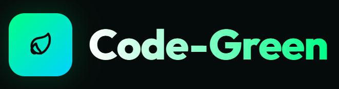
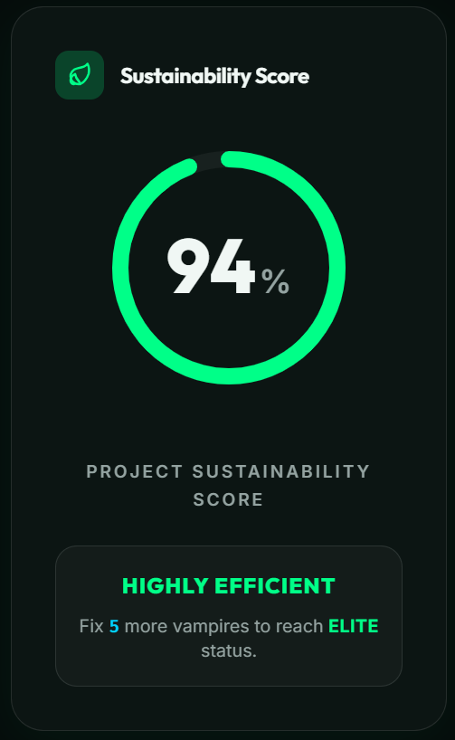
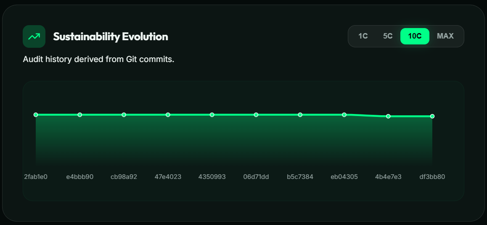
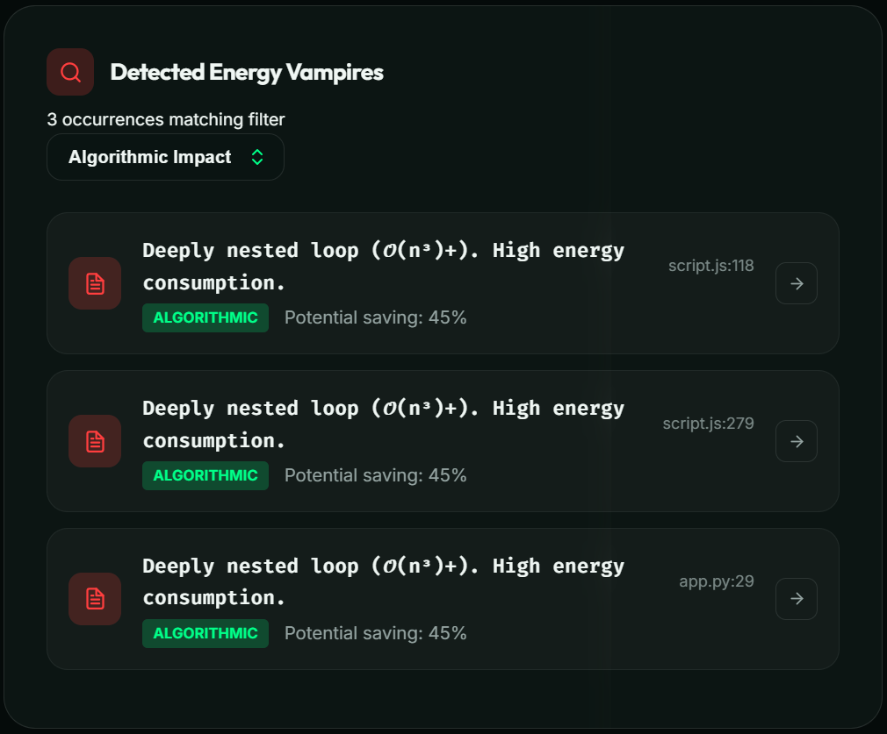
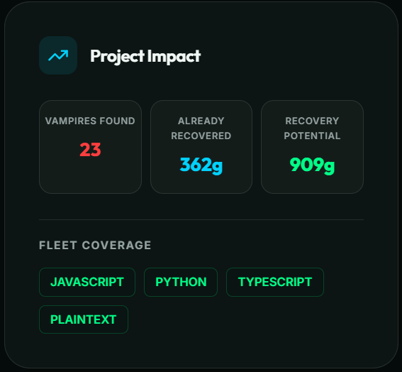
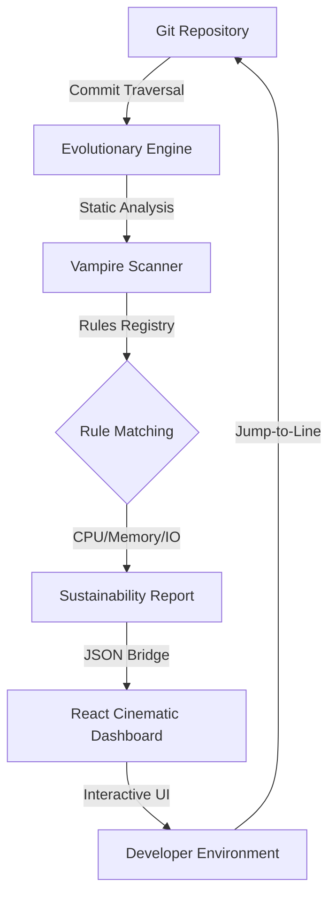

<div align="center">



# Sustainable Computing Auditor
> **"Transforming Carbon-Heavy Algorithms into Eco-Futurist Efficiency."**

[](https://github.com/arjaviii/code-green)
[](LICENSE)
[](https://marketplace.visualstudio.com/)
[](package.json)

[🚀 Features](#-key-innovations) • [🏗 Architecture](#-how-it-works) • [🛠 Installation](#-installation--setup) • [🕹 Walkthrough](#-walkthrough) • [⚖️ Judge's Corner](#-judges-corner-qa)

---

</div>

## 🧭 The Vision
**Code-Green** is a professional-grade VS Code extension designed to bridge the gap between **Software Engineering** and **Environmental Sustainability**. In an era where data centers consume nearly 3% of global electricity, Code-Green empowers developers to visualize, audit, and eliminate "Carbon Leakage" directly from their IDE.

---

## 🚀 Key Innovations

<table align="center">
  <tr>
    <td width="50%" align="center">
      <h3>🌍 Project Sustainability Score</h3>
      <p>A single, data-driven health metric derived from <b>Deep Workspace Audits</b> and assigned efficiency weighting.</p>
    </td>
    <td width="50%" align="center">
      <h3>🧬 Evolutionary Auditing</h3>
      <p>Analysis across <b>1C, 5C, 10C, or MAX</b> commits using Stock-Market style range selectors.</p>
    </td>
  </tr>
  <tr>
    <td width="50%" align="center">
      <h3>⌨️ High-Speed Audit Console</h3>
      <p>Dynamic <code>Pseudoterminal</code> implementation with <b>in-place line updates</b> (No log spam).</p>
    </td>
    <td width="50%" align="center">
      <h3>🖱 Jump-to-Code Navigation</h3>
      <p>One-click arrow icons that open the target file, scroll to the line, and <b>highlight</b> the inefficiency.</p>
    </td>
  </tr>
</table>

---

## 🖼️ Extension Snippets

<div align="center">

<table align="center">
  <tr>
    <td width="36%" align="center">
      <br>
      <b>Sustainability Score Gauge</b>
    </td>
    <td width="64%" align="center">
      <br>
      <b>Evolutionary Trend Graph</b>
    </td>
  </tr>
</table>

<table align="center">
  <tr>
    <td width="55%" align="center">
      <br>
      <b>Energy Vampire Detection</b>
    </td>
    <td width="45%" align="center">
      <br>
      <b>Project Impact Metrics</b>
    </td>
  </tr>
</table>

</div>

---

## 🧬 How it Works
The Code-Green engine traversal uses a high-performance static analysis pipeline to identify "Energy Vampires."



---

## 🦇 The Energy Vampire Taxonomy
Code-Green identifies four critical taxonomies of inefficiency that bleed data center resources.

| Category | Typical Vampire | Environmental Cost | Green Solution |
| :--- | :--- | :--- | :--- |
| **CPU** | Loop Concatenation | High thermal output per cycle | String Builders / Buffers |
| **Memory** | Inefficient Collection Types | Frequent GC GC overhead | Primitive Arrays / Optimal Lists |
| **I/O** | Redundant DB Queries | Physical hardware pin power-on | Caching / Batching |
| **Algorithm** | O(n³) Complexity | Exponential energy scaling | Optimized Sorts / Data structures |

---

## 🛠 Installation & Setup

<details open>
<summary><b>Phase 1: The Environment</b></summary>
Ensure you have <b>Node.js (LTS)</b>, <b>VS Code</b>, and <b>Git</b> installed on your system.

1.  **Clone the Repository**:
    ```powershell
    git clone https://github.com/arjaviii/code-green.git
    cd code-green
    ```
2.  **Verify Git**: Ensure your terminal recognizes `git --version` as the Evolutionary Auditing engine relies on it.
</details>

<details>
<summary><b>Phase 2: Dependencies</b></summary>

```powershell
# Root level
cd extension
npm install
cd ../dashboard
npm install
```
</details>

<details>
<summary><b>Phase 3: The Definitive Build</b></summary>

```powershell
cd extension
npm run build-all
```
> [!IMPORTANT]
> This command compiles the logic (**tsc**) and bundles the React dashboard (**vite**) into a single package.
</details>

<details>
<summary><b>Phase 4: Sideloading (Run)</b></summary>
Open the <b>extension/</b> folder in VS Code and press <b>F5</b> to launch the specialized [Extension Development Host].
</details>

---

## 🕹 Walkthrough

1.  **Mission Control**: Click the **Leaf Icon** in your sidebar.
2.  **Historical Audit**: Toggle the **10C** or **MAX** ranges on the graph.
3.  **Vampire Hunting**: Use the dropdown to filter by "CPU Impact."
4.  **Instant Fix**: Use the **Arrow Icon** to jump straight to the offending code block.

---

## ⚖️ Judge's Corner (Q&A)
<details>
<summary><b>Fundamental Conceptual & Technical Questions</b></summary>

### 💡 Conceptual Part
**1. Why does code efficiency matter for the environment?**
Inefficient code makes computers work harder, generating more heat and consuming more electricity. At a global scale (data centers), this adds up to a massive carbon footprint.

**2. What is an "Energy Vampire"?**
It's an inefficient code pattern that performs a task correctly but uses more power than necessary (e.g., using a sledgehammer to crack a nut).

**3. What does the "Sustainability Score" represent?**
It's a health check for your project’s efficiency—calculated by penalizing the score based on the number and severity of vampires found.

**4. How does "Evolutionary Auditing" help?**
It lets you look back in time at previous versions of your code to see if your project is getting greener or more "energy-drained" over time.

*(... and 16 more questions included in the repository documentation)*

### 🛠️ Technical Part
**1. How does the scanner find vampires without running the code?**
It uses **Static Analysis**, scanning the source code for specific text patterns and architectural anti-patterns.

**2. Why use a "Pseudoterminal" for logs?**
Standard terminals spam new lines. Our Pty implementation provides in-place updates, making the audit look like a high-performance system console.

**3. How does the "Jump-to-Code" feature work?**
The React dashboard sends a `postMessage` to the VS Code backend with the file path and line number, which then opens the document and scrolls the cursor.
</details>

---

<p align="center">
  <i>“Optimization is the ultimate form of environmentalism in the digital age.”</i><br>
  <b>— The Code-Green Team —</b>
</p>
